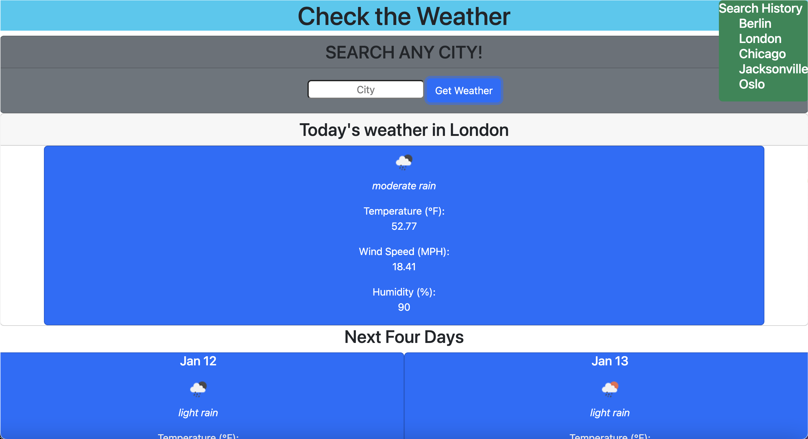

# Weather App

In this app, you can check the weather of any city! It also provides a forecast of the next five days. I utilize bootstrap 5 for my design. There is also a search history function that will save your search history in local storage. You can click on past searches to quickly bring up old searches. Note: the local storage feature is not available on mobile at this time. 

## Link and Screenshot

[Link](https://dltorrise.github.io/Weather-App/)

Screenshot:

## FYI

Sometimes the API's take about 20 seconds to load. Keep this in mind when testing. 

## Acknowledgements

I was able to animate my title using the help of Andreas Zettl's article on javascript.plainenglish.io

[Link](https://javascript.plainenglish.io/animate-your-website-title-with-unicode-emoji-characters-d4aa35fb0eeb)
